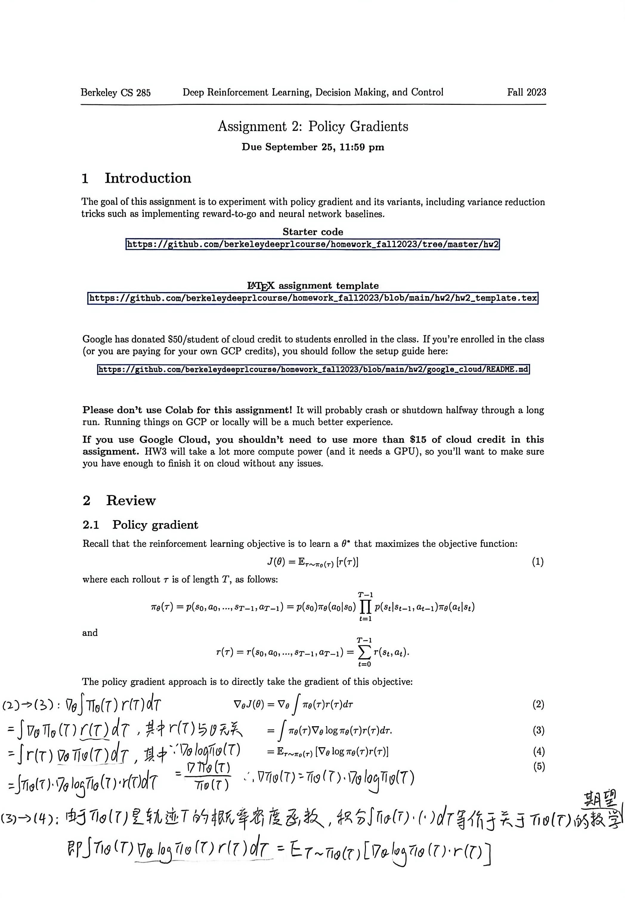
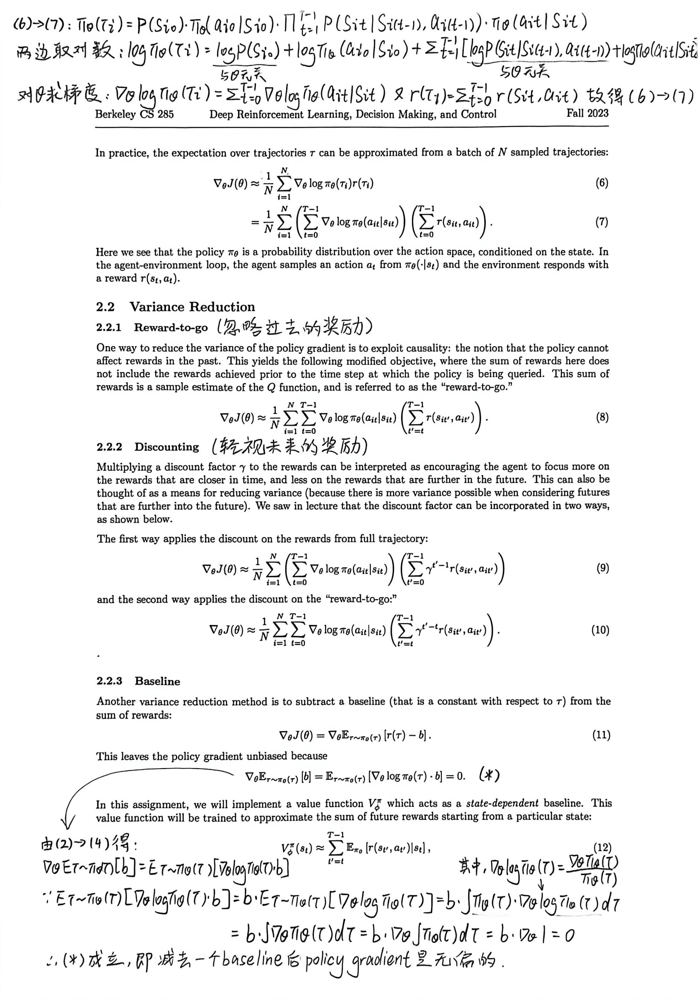
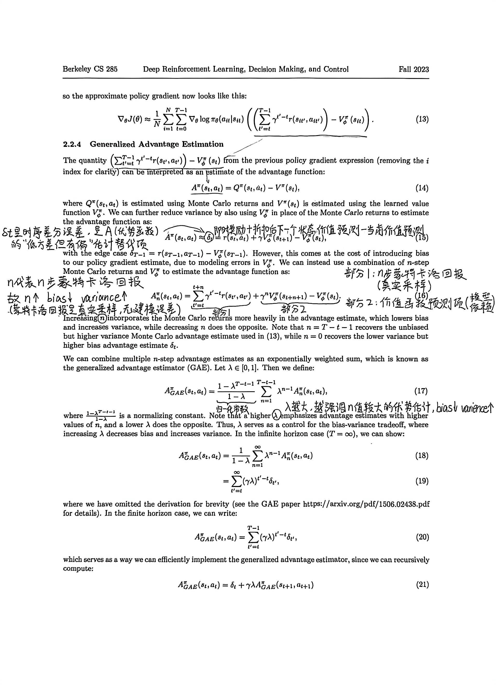

# CS285 hw2: Policy Gradients

## Policy Gradients 公式推导

## Setup

See [installation.md](installation.md). It's worth going through this again since some dependencies have changed since homework 1. You also need to make sure to run `pip install -e .` in the hw2 folder.

## Running on Google Cloud
Starting with HW2, we will be providing some infrastructure to run experiments on Google Cloud compute. There are some very important caveats:

- **Do not leave your instance running.** The provided infrastructure tries to prevent this, but it will still be easy to accidentally leave your instance running and burn through all of your credits. You are responsible for making sure you use your credits wisely.
- **Only use this for big hyperparameter sweeps.** Definitely don't use Google Cloud for debugging; only launch a job once you are 100% sure your code works. Even then, single jobs will probably run faster on your local machine (yes, even if you don't have a GPU). The only reason to use Google Cloud is if you want to run multiple jobs in parallel.

For more instructions, see [google_cloud/README.md](google_cloud/README.md).

## Complete the code

There are TODOs in these files:

- `cs285/scripts/run_hw2.py`
- `cs285/agents/pg_agent.py`
- `cs285/networks/policies.py`
- `cs285/networks/critics.py`
- `cs285/infrastructure/utils.py`

See the [Assignment PDF](hw2.pdf) for more info.